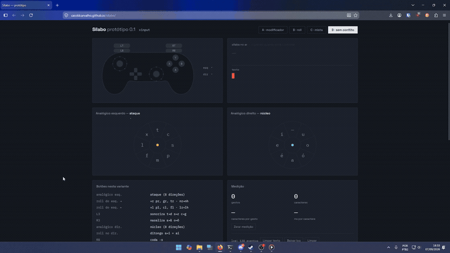

<div align="center">

# Sílabo

**Um teclado que digita sílabas inteiras, com as duas mãos num controle de videogame.**

Os dois analógicos se movem ao mesmo tempo: o esquerdo escolhe a consoante,
o direito escolhe a vogal. Um gatilho fecha a sílaba.

[**▶ Abrir o protótipo**](https://caioldcarvalho.github.io/silabo/) · [Briefing](docs/BRIEFING.md) · [Achados](docs/ACHADOS.md)

</div>

---

<div align="center">

[](docs/demo.mp4)

<sub>*Digitando ao vivo. [Vídeo completo com áudio](docs/demo.mp4) (1min).*</sub>

</div>

---

## A ideia

Um controle tem **dois polegares que se movem em paralelo**. Um teclado obriga
os dedos a irem um de cada vez. Se cada polegar carregar metade da sílaba, os
dois chegam juntos:

```
       analógico esquerdo            analógico direito
            ataque                        núcleo
              ↓                             ↓
              c            +                a          =    "ca"
                          ↑
                     um gesto só
```

```
programa   →  3 gestos, 8 caracteres
abacate    →  4 gestos, 7 caracteres
cantar     →  2 gestos, 6 caracteres
```

**Entre 1,8 e 2,5 caracteres por gesto — sem dicionário e sem predição.**
Medido em sessão real: **2,15**. O ganho é estrutural, não vem de heurística:
`B` + `a` é sempre "ba", por regra.

> Inspirado no [8vim](https://8vim.com/), onde a letra não é uma posição e sim
> um caminho. O que se quis preservar: gesto contínuo, uso *eyes-free* depois de
> treinado, e memória muscular de **movimento** em vez de posição.

---

## Rodar

Arquivo único, sem dependências, sem build. Abra
**[caioldcarvalho.github.io/silabo](https://caioldcarvalho.github.io/silabo/)**
ou o `index.html` local, plugue um controle e aperte um botão para o navegador
enxergá-lo.

Sem controle, dá para testar no teclado:

| teclas | função |
|---|---|
| `W A S D` + `Q E Z C` | analógico esquerdo — **ataque** |
| `I J K L` + `U O M .` | analógico direito — **núcleo** |
| `Espaço` | confirma a sílaba (RT) |
| `1` `2` `3` `4` `5` | LB, LT, RB, L3, R3 |
| `Enter` · `Backspace` | fecha a palavra · apaga |
| `←` `→` · `↓` | cicla acento · cicla sibilante |

---

## O layout

### Ataque — analógico esquerdo

As consoantes mais frequentes do português nas quatro cardinais; **L3**
sonoriza, dando o par:

| | ↑ | → | ↓ | ← | ↗ | ↘ | ↙ | ↖ |
|---|---|---|---|---|---|---|---|---|
| **base** | t | s | m | l | c | p | f | x |
| **+ L3** | d | z | n | r | g | b | v | j |

Analógico em repouso = **ataque zero** (sílaba que começa com vogal).

**Deslizar compõe.** Rolar o analógico até `→` acrescenta um **r**, até `←`
acrescenta um **l** — `p`→`→` dá "pr", `c`→`←` dá "cl". Onde o cluster é
proibido em português, o slot está vago e foi reaproveitado:

```
n → →  =  nh          l → →  =  lh          r → →  =  rr
```

### Núcleo — analógico direito

O arranjo segue o trapézio vocálico do IPA — frente à esquerda, fundo à direita,
altura em cima — mas a tela mostra só letras que qualquer alfabetizado
reconhece:

```
        —              ↑  sem vogal (consoante solta, sigla)
     i     u
     e     o           roll = ditongo:   a→i = "ai"   ·   o→u = "ou"
     é     ó
        a              R3 nasaliza:      a→ã   ·   o→õ
```

O roll lê **o gate de origem, o de destino e as inversões de sentido** — os
gates apenas atravessados no caminho são viagem, não intenção. É evento
discreto, sem cronômetro.

### Coda

`RB` = **-s** (plural) · `RB`+`LB` = **-r** (todos os infinitivos) · `RB`+`LT` = **-l**

---

## A grafia

O português não é fonêmico o bastante para a escrita ser função do som: *sela* e
*cela*, *sinto* e *cinto* são homófonos. Onde nenhuma regra decide, a escolha
volta para quem digita — com **um fato motor só**:

> *O som do gate em que você começou, escrito com a letra que mora em ↗.*

| gesto | sai | |
|---|---|---|
| `s` roll ↗ | **c** / **ç** | cebola, cidade · ação, moço |
| `x` roll ↗ | **ch** | chave, chão |
| `j` roll ↗ | **g** | gente, girafa |

Não é uma tabela de pares: os três terminam no mesmo gate. E `s`, `x`, `j` são
exatamente as consoantes que **não aceitam líquida** em português — então o slot
de roll delas estava livre, e a re-grafia nunca colide com um cluster.

O resto o motor deduz sozinho, sobre **o buffer da palavra inteira**: `c`→`qu`
antes de e/i, `s`→`ss` entre vogais, o `n` nasal virando `m` antes de p/b,
`ãu`→`ão`, `ãe`, `õe`.

**D-pad — o que é lexical e nenhuma regra resolve:**

| | |
|---|---|
| `→` / `←` | cicla o acento da última vogal · `a á â ã à` · `e é ê` · `o ó ô õ` |
| `↓` | cicla a sibilante · `ss → s → z` |

O ciclo é reversível por construção e sempre volta ao começo.

---

## Por que segmentar não tem como errar

`ca.mpo` e `cam.po` produzem **"campo"** — as duas. Não existe divisão errada,
porque o ortografador trabalha sobre a palavra, não sobre a sílaba. Consequência
prática: **não há estado de erro**. Ninguém trava tentando lembrar onde a
palavra se separa, e nomes próprios e estrangeirismos saem em pedaços
arbitrários sem problema nenhum.

## Por que não existe "modo iniciante"

O commit é por gatilho — **sem timeout, sem cronômetro**. O gesto do novato e o
do experiente são **o mesmo gesto**, só comprimido no tempo:

- **iniciante** — empurra, lê o overlay, empurra o outro, confirma *(~2s)*
- **experiente** — os dois polegares saem juntos, o overlay nem renderiza *(~150ms)*

Não há nada a desaprender depois. É onde quase todo método alternativo morre.

---

## O que a interface mostra

**O desenho do controle** acende em vermelho o que está pressionado, com os
analógicos defletindo de verdade e oito pontos ao redor de cada base marcando os
gates visitados — o de origem em branco, os do roll em vermelho.

**Os satélites** aparecem em volta da casa em que o analógico está, dizendo o
que cada modificador faria **e qual gatilho o produz**. Clusters que o português
não admite não são oferecidos.

**A telemetria** registra a sessão: cada sílaba com o gesto que a produziu, as
palavras, os apagamentos, e os conflitos — que o motor detecta sozinho, quando
um modificador é apertado e seu efeito descartado. Baixa em JSON pelo painel de
medição, sobrevive a recarga, e **nada sai da máquina**.

---

## Estado

Protótipo de navegador funcional. Um layout só, o que sobrou de
[quatro que foram testados](docs/ACHADOS.md) — os três anteriores tinham, cada
um, um jeito de tornar sílabas **impossíveis de digitar**, e todos pelo mesmo
motivo:

> Um modificador que significa uma coisa no ataque e outra na coda mais cedo ou
> mais tarde colide. A saída foi dar à líquida um endereço que só é dela — o
> roll — e deixar `LB`/`LT` livres para a coda. **Nada é compartilhado, então
> nada colide:** as 280 formas de sílaba que o desenho promete são alcançáveis.

Medido em sessão real: **0 conflitos**, 12% de sílabas corrigidas, 2,15
caracteres por gesto.

**Lacunas conhecidas**, deliberadamente explícitas em vez de meio-resolvidas:

- `x` vs `ch` ainda é decisão não tomada
- tritongo (`Uruguai`, `quais`) provavelmente pede labialização no ataque, não
  tritongo no núcleo
- `k`, `w`, `y` e `h` não têm endereço — o gate `—` do núcleo é redundante com o
  repouso e é o candidato natural
- plural de `-ão` é lexical (pães/mãos/ações), então vai sílaba a sílaba

## Testes e ferramentas

Sem dependências. Só `node`.

```fish
node test/motor.test.mjs      # 72 casos — montagem da sílaba e ortografia
node test/ui.test.mjs         # 45 casos — o que os satélites, o HUD e o log geram
node tools/corpus.mjs         # mede grafias contra corpus real de pt-BR
node tools/screenshot.mjs     # a página em PNG (--uso, --medir)
node tools/pad-preview.mjs    # o desenho do controle em PNG
```

O `tools/corpus.mjs` é o que decidiu várias escolhas por medição em vez de
intuição — inclusive derrubar duas decisões minhas que pareciam certas.

## Para onde vai

Separação inegociável: **um resolvedor de fonemas puro** e **um ortografador**.
Trocar de língua deve significar trocar só o segundo.

```
src/
  phonology.js       monta a sílaba a partir dos gates (puro, testável, sem UI)
  orthography-pt.js  a grafia do português sobre o buffer da palavra
  wheel.js  ·  input.js  ·  metrics.js
```

Depois, nativo: **Windows** (XInput/SDL2, overlay `WS_EX_LAYERED`, injeção via
`SendInput`) e **Linux** (evdev para ler, **uinput** para injetar — o overlay é
a parte dolorida, X11 é fácil e Wayland exige `layer-shell`). Num código só,
seria Rust com `gilrs` + `egui`.

> Este é um experimento, sem pretensão de substituir teclado. Mas decisões que
> fechem portas de internacionalização ou de acessibilidade são evitadas de
> propósito.

## Licença

MIT — ver [`LICENSE`](LICENSE).
